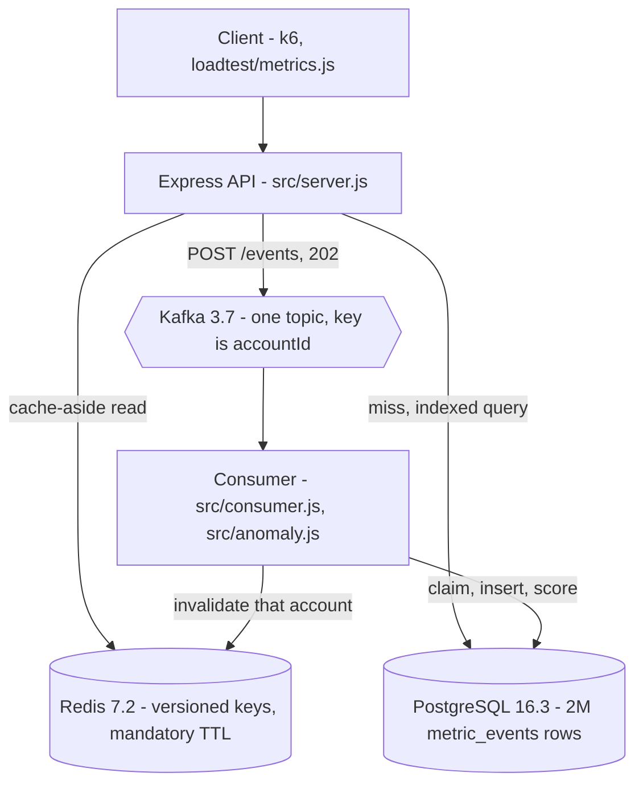
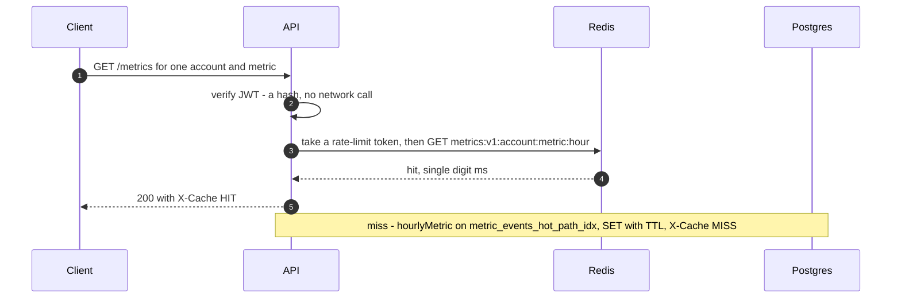

# sub-200ms-stack

Runnable reference implementation of a metrics API held to a 200ms p95 budget:
Express + PostgreSQL + Redis + Kafka on Docker Compose, with a k6 load test and
measured p95. It is the architecture from section 03 of my profile README, drawn
below so that this repo does not send you somewhere else to see the shape of it.

The reason this exists is narrow. Claiming a service holds under 200ms at p95 is
free; a claim that can fail a command is not. Everything here is arranged so the
claim is falsifiable: the budget is a value in `src/config.js`, the load test
asserts it as a threshold, and `k6` exits non-zero when it is missed.

If you only read two files, read `src/queries.js` for the SQL and `db/schema.sql`
for the indexes. That is where the latency is actually won or lost. Everything
else is plumbing around them.

## Architecture



The read path spends the budget in this order, cheapest hop first, so that every
stage able to answer early sits in front of every stage that costs more:



Writes go the other way and never touch a read synchronously. `POST /events`
validates, produces to Kafka keyed by `accountId` so one account's events stay
ordered, and returns 202. The consumer claims the event id, reads the baseline,
inserts the row, scores it against that baseline, and invalidates the account's
cache keys after the write rather than before.

Two things this collapses on purpose, against the diagram on my profile: the
gateway is middleware inside the API process, and the three read services are
three routes in it. Splitting either one adds a network hop without changing a
line of the SQL the milliseconds actually go into, and this repo exists to make
the milliseconds checkable, not to demonstrate boxes. The insights service here
is arithmetic in `src/anomaly.js` rather than an LLM call, for the same reason:
a model behind that arrow would make the p95 a measurement of somebody else's
service.

## The budget

Written down per hop in `src/config.js`, because a budget nobody enforces is a
wish:

| Hop | Budget | Enforced by |
| --- | --- | --- |
| JWT verification | 2ms | a hash, no network call (`src/auth.js`) |
| Rate limit | 3ms | one atomic Redis script (`src/rateLimit.js`) |
| Cache hit | 10ms | one Redis GET (`src/cache.js`) |
| Postgres query | 120ms | logged on breach (`src/db.js`) |
| **Total** | **200ms** | fails the k6 run (`loadtest/metrics.js`) |

`test/budget.test.js` asserts these add up, and that the number the load test
fails on is still the number the budget claims. Relaxing one without the other
breaks the test rather than the truth of the README.

Measured results go in `bench/RESULTS.md`. It ships with empty tables on purpose:
the numbers belong to a run on a named machine, not to a paragraph.

## Running it

```sh
docker compose up -d --build
docker compose exec api npm run seed      # 500 accounts, 2,000,000 events
curl -s 'localhost:3000/metrics?accountId=101' | head -c 400
```

The seed is deliberately large. At two thousand rows every plan looks fast and the
benchmark proves nothing, which is how most we-added-Redis-and-it-got-faster
writeups end up meaningless. It takes a few minutes and runs `ANALYZE` at the end,
without which the planner is guessing.

Then, with [k6](https://k6.io) installed on the host:

```sh
k6 run loadtest/metrics.js
```

Unit tests need nothing running at all:

```sh
npm test
```

### Outside Docker

There is no `dotenv` dependency, so nothing reads `.env` on its own. Load it into
the environment yourself:

```sh
cp .env.example .env
set -a && . ./.env && set +a
npm start
```

`src/config.js` refuses to start on a missing variable rather than discovering it
halfway through the first request, so a mistake here is immediate and legible.

## API

| Method | Path | Auth | Cached | Notes |
| --- | --- | --- | --- | --- |
| GET | `/healthz` | none | no | Liveness. Checks nothing downstream, deliberately. |
| GET | `/readyz` | none | no | Postgres and Redis gate readiness; Kafka is reported but does not. |
| GET | `/metrics?accountId=&metric=&hours=` | optional | yes | Hourly buckets. Sets `X-Cache: HIT` or `MISS`. |
| GET | `/reports/daily?accountId=&days=` | optional | no | Daily rollup with a p95 per metric. |
| GET | `/insights?accountId=&days=` | optional | no | Anomalies written by the consumer. |
| POST | `/events` | required | -- | Publishes to Kafka. Returns 202. |

Reads take an optional credential and are still rate limited when anonymous, keyed
by IP instead of by subject. Writes require one: the choice there has to be
between no credential and a valid one, never between no credential and any
credential.

### Posting an event

```sh
TOKEN=$(docker compose exec -T api npm run --silent token)

curl -s -X POST localhost:3000/events \
  -H "Authorization: Bearer $TOKEN" \
  -H 'Content-Type: application/json' \
  -d '{"accountId":101,"metric":"latency_ms","value":842.5}'
```

202 means accepted, not stored. `src/consumer.js` reads the event, scores it
against the account's recent history, writes the row and the insight, and
invalidates that account's cached reads. Claiming 201 would be a lie about
durability that a caller could build a retry policy on.

Supply your own `eventId` when you retry. `processed_events` deduplicates on it, so
a retried POST cannot double count; without one, a retry is genuinely a new event.

## Decisions worth arguing with

Each of these is explained where it is implemented, so the reasoning stays next to
the code that has to honour it.

**The cache key is truncated to the hour.** `since` computed as now-minus-a-week is
a different value on every request, which would make every key unique and every
read a miss. Truncated, the key is stable for an hour and the TTL is what bounds
staleness -- which is the knob that is meant to bound it.

**Every cached key has a named event that clears it.** Any write for that account,
from the consumer. Where no such event exists -- the daily rollup -- the response is
not cached at all, because a cache without an invalidation rule is a bug with a
latency graph attached.

**The rate limiter is a Lua script.** GET, compare and SET from Node is a race: two
concurrent requests both read the same count, both decide they are under the limit,
and the limit becomes a suggestion. It also fails open, loudly, because an outage
of the limiter should not become an outage of the product.

**The JWT algorithm is pinned.** Left unpinned, the library honours whatever the
token header nominates, which lets the credential choose how it gets checked.
`test/auth.test.js` fails if that pin is ever removed.

**Unknown accounts are 404, not empty 200.** A dashboard cannot tell the difference
between an account with no data and a typo in the id, and it will render a
confident empty chart for both.

**One index is deliberately absent.** `metric` has four distinct values across two
million rows, so an index on it would be ignored by the planner and maintained on
every write. `bench/explain.md` shows how to confirm that rather than take it on
faith.

## Layout

```
src/config.js      the only file that reads process.env, and the budget
src/db.js          pg pool: statement timeout, fail-fast checkout
src/cache.js       versioned keys, mandatory TTL, SCAN + UNLINK invalidation
src/queries.js     every SQL statement the service runs, in one reviewable file
src/auth.js        JWT verification with a pinned algorithm
src/rateLimit.js   token bucket, atomic, per subject, fails open
src/anomaly.js     z-score arithmetic, no I/O, so it is testable alone
src/server.js      the HTTP layer and nothing else
src/consumer.js    the write path: claim, score, insert, invalidate
db/schema.sql      tables, and the index section that matters
db/seed.js         2,000,000 events plus ANALYZE
loadtest/          k6 run that fails the build on a missed budget
scripts/token.js   mints a token the API will accept
bench/             results and query plans
test/              unit tests that need no services
```

## Known limitations

Listed because a reference implementation that hides its edges is not much of a
reference.

- **The consumer is not transactional.** It claims an event before processing it,
  so a crash between the claim and the insert drops that event. The alternative --
  claiming last -- double counts on replay, which is worse. Doing it properly means
  running the claim, the insert and the insight in one transaction, which needs
  `src/queries.js` to accept a client rather than always using the pool.
- **No dead letter topic.** An unparseable message is logged and skipped so it
  cannot stall its partition, but that means the payload is countable rather than
  inspectable.
- **Tokens cannot be revoked before they expire.** Accepted on the grounds that
  they last an hour. Immediate revocation means a deny list of `jti` values in
  Redis, which puts a network hop back on the hot path -- a decision someone should
  make on purpose.
- **Unknown accounts are not negatively cached.** Every 404 costs a Postgres round
  trip, which is fine for a typo and not fine for someone enumerating ids.
- **`RATE_LIMIT_MAX` is raised in `docker-compose.yml`.** All load-test traffic
  arrives from one address, so a production-shaped per-IP limit would turn the
  benchmark into a measurement of the token bucket. The default in `.env.example`
  is the realistic one.
- **Single broker, single partition by default.** Ordering per account is
  guaranteed by keying messages on `accountId`, but the partition count in Compose
  is not tuned for anything.

## License

MIT. See `LICENSE`.
